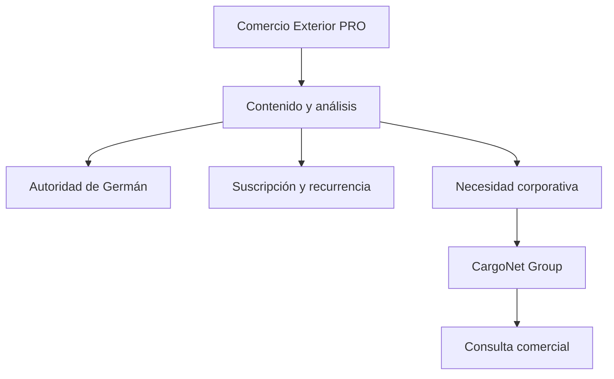

# COMERCIOEXTERIOR.PRO

## Brief maestro de producto, contenidos, UX, SEO y desarrollo

> Documento ejecutable para construir una web multipágina robusta en OpenCode o Zed Editor.
>
> Dominio objetivo: `https://comercioexterior.pro`
>
> Idioma inicial: español (Argentina y Latinoamérica)
>
> Versión: 1.0 - 17 de julio de 2026

---

## 0. Instrucción principal para el agente de desarrollo

Construir un portal editorial multipágina, rápido, accesible, visualmente premium y preparado para crecer, llamado **Comercio Exterior PRO**. El portal combina:

1. La mirada y el liderazgo de opinión de **Germán Muchico**.
2. La experiencia institucional y capacidad consultiva de **CargoNet Group**.
3. Información útil, actualizable y verificable sobre comercio exterior, logística internacional, supply chain, aduanas, internacionalización de empresas y radicación de compañías extranjeras en Argentina.
4. Un sistema de contenidos funcional: portada editorial, categorías, buscador, filtros, fichas de autor, artículos individuales, notas relacionadas, newsletter y contacto.

No construir una landing page larga ni una copia del sitio de CargoNet. Debe sentirse como un **medio especializado y plataforma de autoridad**, con navegación real entre páginas, URLs individuales para las notas y una arquitectura preparada para publicar contenido en forma sostenida.

El resultado debe poder ejecutarse localmente con instrucciones simples, compilar sin errores y desplegarse en Netlify o Vercel. No dejar botones simulados, enlaces `#`, formularios mudos ni textos lorem ipsum.

---

## 1. Resumen ejecutivo

### 1.1 Idea central

**Comercio Exterior PRO** será un portal independiente, liderado editorialmente por Germán Muchico y respaldado por la trayectoria de CargoNet Group. Su propósito es transformar conocimiento complejo de comercio exterior en criterios claros para quienes toman decisiones.

No es un catálogo de transporte ni un sitio personal tradicional. Es la intersección entre:

- análisis ejecutivo;
- experiencia empresaria;
- educación práctica;
- actualidad sectorial;
- reputación personal;
- generación de demanda calificada para CargoNet Group.

### 1.2 Propuesta de valor

> Información y análisis para decidir mejor en comercio exterior.

El portal debe responder una pregunta concreta: **¿qué necesita comprender hoy un empresario, gerente o inversor para operar, crecer o instalarse en Argentina sin improvisar?**

### 1.3 Rol de cada marca

| Actor | Rol | Qué comunica | Qué no debe hacer |
|---|---|---|---|
| Comercio Exterior PRO | Medio/portal editorial | Análisis, guías, columnas, actualidad, recursos | Parecer una agencia de cargas o duplicar CargoNet |
| Germán Muchico | Director editorial y voz experta | Visión, criterio, lectura estratégica, experiencia en primera persona | Cotizar, vender por DM, usar preguntas forzadas o hablar como atención al cliente |
| CargoNet Group | Respaldo institucional y destino comercial | Capacidad consultiva, soluciones, presencia e infraestructura | Apropiarse de toda la portada o convertir cada nota en publicidad |

### 1.4 Regla editorial no negociable

**El CEO informa; la empresa vende.**

- En páginas y artículos firmados por Germán, usar primera persona cuando corresponda.
- Cerrar con conclusiones asertivas, no con preguntas abiertas para “generar debate”.
- No usar “escribime por DM”, “analizamos tu caso gratis”, “pedime presupuesto” ni llamados equivalentes bajo la firma personal.
- Las acciones comerciales deben estar identificadas como institucionales y derivar a CargoNet Group.
- Hablar desde el impacto comercial, la mitigación de riesgos, la ingeniería logística y la competitividad; evitar convertir la voz de Germán en un manual de paletizado, maquinaria o tareas operativas.
- No usar emojis en la interfaz editorial ni en los textos.
- Excluir las mudanzas internacionales del foco de contenidos.
- Priorizar consultoría corporativa y empresas extranjeras que buscan instalarse y operar en Argentina.

---

## 2. Objetivos del producto

### 2.1 Objetivos principales

1. Posicionar a Germán Muchico como referente ejecutivo en comercio exterior y logística internacional.
2. Construir tráfico orgánico mediante contenidos evergreen y análisis de coyuntura.
3. Generar engagement de calidad: lectura, recurrencia, suscripción, guardado y compartidos.
4. Crear un puente transparente hacia CargoNet Group para consultas corporativas calificadas.
5. Desarrollar un activo digital propio que no dependa de algoritmos de redes sociales.
6. Servir como centro de distribución para columnas, videos, entrevistas, newsletter y LinkedIn.

### 2.2 Objetivos secundarios

- Capturar búsquedas vinculadas a importar, exportar, supply chain, aduanas y radicación empresarial.
- Ofrecer recursos descargables con consentimiento explícito.
- Permitir futuras versiones en inglés y portugués.
- Facilitar sindicación y reutilización responsable de contenidos.

### 2.3 Indicadores sugeridos

- sesiones orgánicas y usuarios recurrentes;
- profundidad de scroll por artículo;
- tiempo de lectura activo;
- tasa de búsqueda interna con resultado;
- suscripciones confirmadas;
- clics editoriales hacia CargoNet Group;
- consultas corporativas válidas;
- artículos indexados y consultas no marcarias en Search Console;
- backlinks y menciones de Germán como fuente.

No usar páginas vistas como único indicador de éxito.

---

## 3. Audiencias

### 3.1 Decisores de empresas argentinas

Dueños, CEOs, directores, gerentes de supply chain, comercio exterior, compras, finanzas y operaciones. Necesitan reducir incertidumbre, costos ocultos y riesgos regulatorios.

### 3.2 Empresas extranjeras que analizan Argentina

Compañías internacionales, responsables regionales, inversores y asesores que necesitan entender cómo radicarse, importar, exportar, contratar operadores y construir una cadena de suministro local.

### 3.3 Profesionales del ecosistema

Despachantes, forwarders, abogados, bancos, cámaras, consultores, estudiantes avanzados y ejecutivos que buscan interpretación, no solo noticias.

### 3.4 Prensa, medios y organizadores

Periodistas y productores que necesitan una fuente, una biografía verificable, fotos aprobadas, temas de especialidad y canales de contacto.

### 3.5 Necesidades por intención

| Intención | Ejemplo de búsqueda | Respuesta del portal |
|---|---|---|
| Informativa | “qué es una cadena de suministro” | Guía pilar clara y profunda |
| Resolución | “cómo reducir costos ocultos de importación” | Checklist y marco de decisión |
| Coyuntura | “comercio exterior argentino 2026” | Análisis fechado y actualizado |
| Comparativa | “aéreo o marítimo para importar” | Matriz de decisión, no recomendación genérica |
| Internacionalización | “abrir empresa extranjera en Argentina” | Hub de radicación con pasos y advertencias |
| Comercial | “consultoría comercio exterior Argentina” | Página institucional que deriva a CargoNet |

---

## 4. Posicionamiento, tono y lenguaje

### 4.1 Territorio de marca

**Claridad para decidir en un mundo en movimiento.**

Conceptos asociados: criterio, experiencia, perspectiva, contexto, confianza, integración, competitividad, previsibilidad y visión internacional.

### 4.2 Tono

- ejecutivo, sobrio y humano;
- informado sin sonar académico;
- firme sin ser grandilocuente;
- didáctico sin infantilizar;
- argentino con alcance regional;
- natural, sin frases típicas de IA;
- sin emojis;
- sin abuso de signos de exclamación;
- sin promesas absolutas.

### 4.3 Voz de Germán

Cuando firme Germán:

- usar primera persona: “En más de tres décadas vi…”, “Mi lectura es…”, “Aprendí que…”;
- hablar de decisiones, consecuencias y contexto;
- evitar autorreferencia excesiva;
- no hablar de sí mismo en tercera persona;
- no utilizar CTA comercial personal;
- terminar con una afirmación útil.

Ejemplo correcto:

> Después de décadas trabajando con cadenas internacionales, confirmé que el costo más peligroso no siempre figura en la tarifa. Aparece cuando una decisión fragmentada genera demoras, reprocesos o pérdida de previsibilidad. Una operación competitiva comienza antes de mover la carga: comienza con un diagnóstico integral.

Ejemplo incorrecto:

> Soy Germán Muchico, consultor experto. ¿Querés ahorrar en tu próximo envío? Escribime por DM y analizamos tu caso sin cargo.

### 4.4 Léxico prioritario

- optimización de cadenas de suministro;
- mitigación de riesgos aduaneros;
- ingeniería logística;
- estrategia de internacionalización;
- previsibilidad operativa;
- costo total de la operación;
- integración end to end;
- resiliencia de supply chain;
- competitividad empresaria;
- cumplimiento y transparencia.

### 4.5 Claims candidatos

Claim principal recomendado:

> Comercio exterior con criterio.

Alternativas:

- Información para decidir más allá de la frontera.
- La mirada estratégica del comercio internacional.
- Contexto, experiencia y decisiones globales.

---

## 5. Arquitectura multipágina

### 5.1 Navegación principal

1. Inicio
2. Actualidad
3. Análisis
4. Guías
5. Empresas extranjeras
6. Germán Muchico
7. CargoNet Group
8. Recursos
9. Contacto

En desktop, agrupar “Actualidad / Análisis / Guías” dentro de **Temas** si la barra queda saturada. Mantener búsqueda visible. En mobile, usar menú accesible con foco atrapado y cierre mediante Escape.

### 5.2 Mapa de URLs

```text
/
/actualidad/
/analisis/
/guias/
/empresas-extranjeras/
/temas/
/temas/logistica-internacional/
/temas/aduanas-y-regulacion/
/temas/supply-chain/
/temas/importaciones/
/temas/exportaciones/
/temas/mercados-y-tendencias/
/german-muchico/
/german-muchico/historia/
/german-muchico/columnas/
/cargonet-group/
/recursos/
/newsletter/
/buscar/
/contacto/
/prensa/
/autores/german-muchico/
/autores/equipo-editorial/
/notas/[slug]/
/politica-de-privacidad/
/terminos-y-condiciones/
/politica-editorial/
/fuentes-y-correcciones/
/404/
```

### 5.3 Principio de arquitectura

- Las categorías organizan por formato/intención: Actualidad, Análisis, Guías.
- Los temas organizan por especialidad: supply chain, aduanas, importaciones, etc.
- “Empresas extranjeras” funciona como hub estratégico y comercial de alto valor.
- “Germán Muchico” construye autoridad personal.
- “CargoNet Group” explica el respaldo institucional y deriva las oportunidades comerciales.
- Cada artículo puede pertenecer a una categoría y varios temas.

---

## 6. Especificación de páginas

### 6.1 Inicio `/`

Objetivo: comunicar en menos de 8 segundos qué es el portal, quién lo dirige y por qué vale la pena volver.

Orden recomendado:

1. **Header editorial**: marca, menú, búsqueda, botón discreto “Recibir análisis”.
2. **Hero tipo portada de medio**:
   - etiqueta: “Comercio Exterior PRO”;
   - H1: “Comercio exterior con criterio.”;
   - bajada: “Análisis, guías y perspectivas para entender el comercio internacional y tomar mejores decisiones.”;
   - nota principal con imagen, categoría, título, extracto, autor, fecha y tiempo de lectura;
   - dos notas secundarias, sin carrusel automático.
3. **La mirada de Germán**: columna destacada con foto natural y una reflexión breve.
4. **Últimos análisis**: grilla de 3 a 6 cards.
5. **Radar de comercio exterior**: lista compacta de novedades fechadas.
6. **Hub empresas extranjeras**: bloque editorial “Operar en Argentina: contexto, decisiones y riesgos”.
7. **Guías esenciales**: contenido evergreen.
8. **Multimedia**: videos o entrevistas con miniatura y duración.
9. **Newsletter**: promesa concreta, frecuencia y formulario.
10. **Respaldo CargoNet Group**: franja institucional breve, no invasiva.
11. Footer completo.

No colocar un formulario de cotización en el hero.

### 6.2 Actualidad `/actualidad/`

Listado cronológico con filtros por tema, año y formato. Cada nota debe mostrar fecha de publicación y, si aplica, fecha de actualización. Incorporar aviso: “La normativa y las condiciones operativas pueden cambiar. Verificá siempre la fuente oficial vigente”.

### 6.3 Análisis `/analisis/`

Columnas interpretativas, escenarios, tendencias y opiniones firmadas. Hero editorial más sobrio. Permitir filtrar por autor y tema.

### 6.4 Guías `/guias/`

Biblioteca de contenidos evergreen. Cards con nivel (“Inicial”, “Intermedio”, “Ejecutivo”), tiempo estimado y fecha de revisión. Agregar rutas de aprendizaje:

- Empezar a importar.
- Prepararse para exportar.
- Entender costos y riesgos.
- Diseñar una supply chain resiliente.

### 6.5 Empresas extranjeras `/empresas-extranjeras/`

Página prioritaria. Debe abordar a compañías que analizan radicarse y operar en Argentina.

H1 sugerido:

> Instalarse en Argentina exige más que abrir una sociedad.

Bajada:

> La operación real comienza cuando estrategia, regulación, aduanas, bancos y logística funcionan como un único sistema.

Secciones:

1. panorama para una empresa internacional;
2. decisiones previas a la radicación;
3. mapa de actores y dependencias;
4. riesgos frecuentes;
5. contenidos relacionados;
6. metodología consultiva end to end de CargoNet;
7. CTA institucional: “Conocer el enfoque de CargoNet Group”.

No prometer asesoría legal propia en jurisdicciones donde no se haya confirmado. Usar “coordinación con especialistas” si corresponde.

### 6.6 Germán Muchico `/german-muchico/`

Página editorial, no currículum frío.

H1:

> Germán Muchico: una vida leyendo el movimiento del comercio global.

Contenido base verificable a revisar antes de publicar:

- más de 35 años en comercio exterior;
- ingreso formal a la actividad el 1 de febrero de 1990;
- fundación de Connexion Transportes Internacionales S.A. en enero de 1999;
- activación de CargoNet el 20 de marzo de 2002;
- expansión a Estados Unidos en 2005 y Brasil en 2009;
- experiencia residiendo y desarrollando operaciones en Miami y Palma de Mallorca;
- CEO y fundador de CargoNet Group;
- Director de Logística en el Comité Argentina de la CCM, según el sitio personal relevado.

Antes del lanzamiento, confirmar fechas, nombres societarios y cargo actual con Germán. No publicar datos marcados como pendientes sin validación.

Secciones: retrato natural, manifiesto, trayectoria cronológica, temas de expertise, columnas recientes, videos, prensa y enlace a CargoNet.

### 6.7 Historia `/german-muchico/historia/`

Timeline accesible que funcione también sin JavaScript. No usar una animación horizontal incómoda. Incluir contexto de cada etapa y aprendizajes, no solo fechas.

### 6.8 CargoNet Group `/cargonet-group/`

Explicar que CargoNet es el respaldo operativo e institucional del portal.

Contenido:

- “Tu socio estratégico en consultoría y logística internacional”.
- enfoque consultivo end to end;
- transporte y logística internacional;
- despachos aduaneros;
- operativa bancaria;
- trading;
- asesoría vinculada a comercio internacional;
- división perecederos;
- presencia en Argentina, Miami y Brasil;
- valores: confianza, innovación y excelencia;
- referencias a ISO 37001 y políticas institucionales, solo con enlaces oficiales.

Por directiva editorial, **no destacar mudanzas internacionales**.

Botón primario institucional: “Visitar CargoNet Group”. Botón secundario: “Realizar una consulta corporativa”.

### 6.9 Recursos `/recursos/`

Biblioteca de checklists, glosario, matrices y ebooks. Los recursos descargables deben existir realmente. Para MVP incluir:

- Checklist previo a una importación.
- Matriz de riesgos de supply chain.
- Glosario esencial de comercio exterior.
- Guía de preguntas para evaluar una operación end to end.

Se pueden entregar como páginas imprimibles antes de generar PDFs.

### 6.10 Contacto `/contacto/`

Separar dos caminos:

**Consulta editorial o prensa**

- nombre;
- organización/medio;
- email;
- tema;
- mensaje.

**Consulta corporativa**

- nombre y apellido;
- empresa;
- cargo;
- país;
- email y teléfono opcional;
- tipo de necesidad;
- mensaje;
- consentimiento de privacidad.

El camino corporativo debe enviar a CargoNet Group o integrarse con su CRM. No mostrar el mail genérico como CTA personal de Germán.

### 6.11 Prensa `/prensa/`

Biografía corta y larga aprobadas, temas sobre los que Germán puede aportar, apariciones verificadas, fotografías autorizadas en color natural y formulario para productores. No inventar apariciones ni logos de medios.

### 6.12 Artículo `/notas/[slug]/`

Estructura obligatoria:

1. breadcrumb;
2. categoría y temas;
3. H1 único;
4. bajada;
5. autor, fecha, actualización y tiempo de lectura;
6. imagen de portada con crédito y alt;
7. resumen “En pocas líneas”;
8. índice anclado para notas largas;
9. cuerpo con H2/H3;
10. fuentes y metodología;
11. disclaimer cuando aplique;
12. ficha de autor;
13. compartir con Web Share API y copia de enlace;
14. notas relacionadas;
15. newsletter.

No agregar CTA comercial dentro de una columna firmada por Germán. Se permite al final un módulo claramente institucional: “Este contenido es editorial. Para conocer las soluciones de CargoNet Group…”.

---

## 7. Sistema editorial y CMS

### 7.1 Recomendación técnica

Usar **Astro + TypeScript + Tailwind CSS**, con contenido en **MDX/Markdown Collections** para el MVP. Astro es apropiado por rendimiento, SEO y generación de páginas editoriales. Preparar una capa de repositorio para migrar luego a Sanity, Strapi o Contentful sin reescribir componentes.

Alternativa aceptable: Next.js con App Router si el equipo ya opera ese stack. No usar un SPA puro para un portal SEO.

### 7.2 Modelo de contenido de una nota

```yaml
title: "El costo invisible de una cadena logística fragmentada"
slug: "costo-invisible-cadena-logistica-fragmentada"
excerpt: "Por qué una tarifa competitiva puede terminar en una operación cara cuando las decisiones no están integradas."
category: "analisis"
topics: ["supply-chain", "logistica-internacional"]
author: "german-muchico"
publishedAt: "2026-07-17"
updatedAt: null
reviewedAt: "2026-07-17"
readingTime: 6
featured: true
heroImage: "/images/articles/cadena-fragmentada.webp"
heroAlt: "Contenedores y grúas en una terminal portuaria durante una operación logística"
imageCredit: "Unsplash / autor pendiente de seleccionar"
seoTitle: "Costos ocultos de una cadena logística fragmentada"
seoDescription: "Cómo detectar costos ocultos, demoras y riesgos cuando una operación de comercio exterior se gestiona por partes."
canonical: null
sources:
  - label: "Fuente oficial o documento consultado"
    url: "https://..."
disclaimer: "Contenido informativo. No constituye asesoramiento legal, aduanero, fiscal ni financiero."
status: "published"
```

### 7.3 Estados editoriales

`idea -> draft -> fact-check -> legal-review-if-needed -> approved -> scheduled -> published -> updated -> archived`

### 7.4 Taxonomía inicial

Categorías:

- Actualidad
- Análisis
- Guías
- Opinión
- Casos y aprendizajes
- Multimedia

Temas:

- Logística internacional
- Supply chain
- Aduanas y regulación
- Importaciones
- Exportaciones
- Empresas extranjeras
- Mercados y tendencias
- Ética y compliance
- Perecederos
- Tecnología aplicada

### 7.5 Política de fuentes

- Priorizar fuentes oficiales: ARCA, BCRA, Boletín Oficial, INDEC, VUCE, SENASA, ministerios, organismos multilaterales y autoridades de cada país.
- Para análisis internacional, sumar WTO/OMC, World Bank, UNCTAD, OECD, IMF cuando sean pertinentes.
- Citar la fuente cerca de la afirmación y agregar listado al final.
- Diferenciar dato, interpretación y opinión.
- No copiar artículos de terceros. Resumir con atribución y enlace.
- No publicar números sensibles al tiempo sin fecha de corte.
- Agregar botón “Reportar una corrección”.

### 7.6 Actualización

- Actualidad: revisar mientras siga visible en portada.
- Guías regulatorias: revisión mínima trimestral o ante cambios normativos.
- Guías evergreen no regulatorias: revisión semestral.
- Biografía y presencia institucional: revisión anual.

---

## 8. Plan editorial de lanzamiento

Publicar al menos 12 piezas reales antes de difundir el portal. No lanzar una biblioteca vacía.

| # | Título | Formato | Autor | Intención |
|---:|---|---|---|---|
| 1 | El costo invisible de una cadena logística fragmentada | Análisis | Germán | Autoridad |
| 2 | Instalar una empresa extranjera en Argentina: 10 decisiones previas a la primera operación | Guía | Equipo editorial | SEO/lead calificado |
| 3 | Importar no empieza con el embarque: empieza con el diagnóstico | Columna | Germán | Autoridad |
| 4 | Logística end to end: qué integra y qué problemas evita | Guía | Equipo editorial | SEO |
| 5 | Cómo construir previsibilidad en comercio exterior | Análisis | Germán | Autoridad |
| 6 | Costos directos, indirectos y ocultos de una importación | Guía | Equipo editorial | SEO |
| 7 | Cinco riesgos aduaneros que deben llegar al directorio | Análisis | Germán | Engagement ejecutivo |
| 8 | Aéreo, marítimo o terrestre: una matriz para decidir | Guía | Equipo editorial | SEO |
| 9 | Perecederos: cuando la logística forma parte del producto | Análisis | Germán | Especialización |
| 10 | Compliance en comercio exterior: por qué la confianza también reduce costos | Análisis | Equipo editorial | Reputación |
| 11 | Argentina como plataforma regional: oportunidades y condiciones | Columna | Germán | Empresas extranjeras |
| 12 | Glosario de comercio exterior para decisores | Recurso | Equipo editorial | Captación orgánica |

### 8.1 Frecuencia sostenible

- 1 columna quincenal de Germán.
- 1 guía evergreen semanal.
- 1 radar o actualización semanal.
- 1 entrevista o video mensual.
- 1 revisión de contenido existente por semana.

Calidad y consistencia tienen prioridad sobre volumen.

---

## 9. Contenidos iniciales listos para cargar

Los siguientes textos son originales de arranque. Deben pasar validación factual y editorial antes de publicar. No presentan asesoramiento legal, fiscal, aduanero o financiero.

### NOTA 1 - El costo invisible de una cadena logística fragmentada

**Slug:** `costo-invisible-cadena-logistica-fragmentada`

**Categoría:** Análisis

**Autor:** Germán Muchico

**Bajada:** Una tarifa competitiva no garantiza una operación eficiente. Cuando cada parte decide de manera aislada, el costo final aparece en demoras, reprocesos y pérdida de previsibilidad.

#### En pocas líneas

- El precio del transporte es solo una parte del costo total.
- La fragmentación multiplica zonas grises y decisiones tardías.
- Integrar información, responsables y escenarios permite anticipar desvíos.
- La logística competitiva se diseña antes de mover la carga.

Durante años, gran parte del comercio exterior se organizó como una suma de proveedores: transporte por un lado, despacho por otro, gestión bancaria en un tercer circuito y decisiones comerciales en un cuarto. Cada actor podía cumplir correctamente su tarea y, aun así, el resultado global ser deficiente.

El problema no siempre es la capacidad técnica. Es la falta de una visión compartida.

Cuando una organización compara alternativas solo por tarifa, deja fuera variables que terminan determinando el costo real: días de inventario, demoras documentales, almacenaje, cambios de ruta, capital inmovilizado, incumplimientos, pérdida de ventas y horas del equipo dedicadas a resolver excepciones.

Una cadena fragmentada también fragmenta la responsabilidad. La información llega tarde, las prioridades no están alineadas y cada decisión optimiza un tramo sin conocer el impacto sobre el resto. El ahorro inicial puede desaparecer frente a un único desvío.

#### Del precio al costo total

La pregunta ejecutiva no es únicamente cuánto cuesta mover una carga. Es cuánto cuesta poner la mercadería disponible, en condiciones, dentro del plazo que necesita el negocio y con un nivel de riesgo aceptable.

Ese enfoque cambia la conversación. Obliga a contemplar la operación completa y a trabajar con escenarios. También permite distinguir entre costos inevitables y costos generados por falta de coordinación.

#### Integrar no significa centralizar todo

Una operación end to end no exige que una sola compañía haga cada tarea. Exige que exista una arquitectura común: objetivos, responsables, hitos, información y criterios de decisión. Los especialistas pueden ser varios; la estrategia debe ser una.

En más de tres décadas en esta industria confirmé que la previsibilidad no surge de eliminar toda incertidumbre. Surge de identificarla temprano, asignar responsabilidades y preparar respuestas antes de que la excepción se transforme en urgencia.

La logística deja de ser un costo defensivo cuando forma parte de la estrategia comercial. Esa integración es la que permite crecer sin multiplicar desorden.

---

### NOTA 2 - Instalar una empresa extranjera en Argentina: 10 decisiones previas a la primera operación

**Slug:** `empresa-extranjera-argentina-decisiones-previas`

**Categoría:** Guías

**Autor:** Equipo editorial

**Bajada:** Una radicación efectiva requiere coordinar estructura societaria, cumplimiento, bancos, aduanas, abastecimiento y distribución antes de comprometer el primer flujo comercial.

Entrar a un mercado no consiste solamente en constituir una sociedad. Para que una empresa extranjera pueda operar en Argentina necesita traducir su estrategia regional a una arquitectura local viable.

#### 1. Definir el objetivo de la presencia local

No es lo mismo vender, importar, fabricar, distribuir, prestar servicios o usar Argentina como plataforma regional. La estructura debe responder al modelo comercial, no al revés.

#### 2. Validar la estructura legal y fiscal

La forma societaria, la representación, los contratos y las obligaciones impositivas requieren asesoramiento profesional actualizado. Estas definiciones condicionan la operación futura.

#### 3. Mapear permisos y organismos

Según el producto y la actividad pueden intervenir autoridades aduaneras, sanitarias, técnicas, ambientales u otras. El mapa regulatorio debe construirse antes de fijar una fecha comercial.

#### 4. Diseñar el circuito bancario y cambiario

Pagos, cobros, financiamiento y documentación deben analizarse con información vigente. La operación bancaria no es un paso administrativo posterior: forma parte de la factibilidad.

#### 5. Determinar la clasificación y el tratamiento de mercaderías

La clasificación arancelaria y las regulaciones aplicables impactan en costos, permisos, documentación y tiempos. No deben definirse por aproximación.

#### 6. Calcular el costo total

Además del valor de compra y el flete, contemplar seguros, tributos, servicios, almacenaje, inventario, distribución, contingencias y costo financiero.

#### 7. Elegir el modelo logístico

La decisión entre transporte aéreo, marítimo o terrestre depende del producto, el volumen, la urgencia, la variabilidad y la promesa comercial.

#### 8. Seleccionar socios y responsables

Definir quién coordina, quién ejecuta, quién valida documentación y quién toma decisiones ante desvíos. La falta de gobierno genera costos aunque los proveedores sean competentes.

#### 9. Preparar escenarios

Construir un escenario base y alternativas frente a demoras, cambios de demanda, restricciones, faltantes o desvíos de costo.

#### 10. Ejecutar un piloto medible

Antes de escalar, validar el circuito completo con indicadores: tiempo total, desvíos, costo puesto, incidencias y aprendizaje operativo.

La instalación efectiva ocurre cuando todas estas decisiones funcionan como sistema. Una buena planificación no elimina la complejidad del mercado; evita descubrirla cuando la mercadería ya está en movimiento.

---

### NOTA 3 - Importar no empieza con el embarque

**Slug:** `importar-empieza-con-diagnostico`

**Categoría:** Opinión

**Autor:** Germán Muchico

**Bajada:** La calidad de una importación se define mucho antes de reservar espacio: en las preguntas que una empresa es capaz de responder al principio.

Cuando una operación empieza por pedir una tarifa, suele faltar una conversación previa. Qué objetivo comercial persigue la importación, cuándo debe estar disponible el producto, qué variabilidad tolera el negocio y cuál es el costo de llegar tarde son preguntas anteriores al embarque.

La ruta más barata puede ser la más cara si obliga a sostener más inventario o rompe una promesa de venta. La alternativa más rápida puede no justificarse si el capital inmovilizado no representa un riesgo. No existe un modo universalmente mejor; existe una decisión coherente con cada negocio.

El diagnóstico también expone dependencias. Documentación del proveedor, clasificación, permisos, pagos, seguros, capacidad de almacenamiento y distribución local forman parte de una única secuencia. Si una pieza no está lista, adelantar otra no necesariamente acelera el resultado.

Por eso la consultoría logística no comienza cuando la carga se mueve. Comienza cuando se traduce una necesidad comercial en requisitos operativos, regulatorios y financieros. Recién entonces tiene sentido comparar rutas y proveedores.

Después de años viendo operaciones exitosas y operaciones costosas, mi conclusión es simple: una importación bien diseñada se reconoce por la calidad de sus decisiones previas. El embarque es la ejecución visible de un trabajo que empezó mucho antes.

---

### NOTA 4 - Logística end to end: qué integra y qué problemas evita

**Slug:** `logistica-end-to-end-que-integra`

**Categoría:** Guías

**Autor:** Equipo editorial

**Bajada:** Un enfoque end to end conecta estrategia, regulación, transporte, aduanas, bancos e información para optimizar el resultado completo.

“End to end” no significa agregar servicios a una propuesta. Significa gestionar la cadena desde el objetivo comercial hasta la disponibilidad final del producto con una lógica compartida.

#### Qué integra

- diagnóstico de la necesidad;
- diseño de escenarios y rutas;
- requisitos documentales y regulatorios;
- coordinación de origen;
- transporte internacional;
- seguros y gestión de riesgos;
- despacho aduanero;
- operativa bancaria vinculada;
- almacenamiento y distribución;
- seguimiento, alertas y evaluación posterior.

#### Qué problemas busca evitar

**Optimización parcial.** Una decisión mejora un tramo y empeora el costo total.

**Información fragmentada.** Cada proveedor maneja una versión diferente del estado de la operación.

**Responsabilidad difusa.** No existe un dueño claro de la excepción.

**Decisiones tardías.** El equipo conoce el riesgo cuando ya no puede prevenirlo.

**Aprendizaje perdido.** Se resuelve la urgencia, pero no se modifica el proceso que la generó.

#### Cuatro fases de trabajo

1. Diagnóstico: entender objetivos, restricciones y riesgos.
2. Diseño: construir una solución específica y alternativas.
3. Ejecución: coordinar hitos, información y responsables.
4. Optimización: medir resultados y corregir causas.

La integración no elimina especialistas ni reemplaza controles. Los conecta. Su valor aparece cuando el resultado se evalúa por desempeño global y no por el cumplimiento aislado de cada proveedor.

---

### NOTA 5 - Cómo construir previsibilidad en comercio exterior

**Slug:** `previsibilidad-comercio-exterior`

**Categoría:** Análisis

**Autor:** Germán Muchico

**Bajada:** Previsibilidad no es adivinar el futuro. Es saber qué variables importan, detectar señales a tiempo y decidir con reglas acordadas.

En comercio exterior siempre existe incertidumbre. Cambian condiciones, rutas, costos, disponibilidad y regulaciones. Esperar un escenario completamente estable es renunciar a decidir.

Las organizaciones más preparadas no son las que suponen que nada va a cambiar. Son las que entienden qué cambios pueden alterar su operación y diseñan respuestas posibles.

La previsibilidad se construye con información confiable, hitos visibles y responsables definidos. También requiere distinguir una alerta de un dato accesorio. Cuando todo se comunica como urgente, la organización pierde capacidad de priorizar.

Un tablero ejecutivo útil no necesita mostrar cada evento. Necesita anticipar impacto sobre disponibilidad, costo, cumplimiento y cliente. La tecnología ayuda, pero no reemplaza el criterio con el que se definieron esas alertas.

También hace falta memoria. Cada desvío debería dejar una mejora: una condición contractual, un control previo, una alternativa de ruta o una responsabilidad más clara. Si el equipo resuelve el mismo problema de manera repetida, no está gestionando incertidumbre; está normalizando ineficiencia.

Mi experiencia me enseñó que la previsibilidad no es quietud. Es capacidad de respuesta organizada. En mercados dinámicos, esa capacidad se transforma en una ventaja competitiva concreta.

---

### NOTA 6 - Perecederos: cuando la logística forma parte del producto

**Slug:** `perecederos-logistica-parte-del-producto`

**Categoría:** Análisis

**Autor:** Germán Muchico

**Bajada:** En una carga perecedera, tiempo, temperatura, cumplimiento y coordinación no son servicios accesorios: determinan el valor que llega al mercado.

En muchas industrias la logística acompaña al producto. En perecederos, forma parte de él. Un alimento, una flor o una carga sensible puede salir de origen con calidad y perder valor si la cadena no conserva las condiciones previstas.

La complejidad no proviene solamente del transporte. Surge de la sincronización entre origen, documentación, autoridades, capacidad, conexiones, controles y entrega. Una demora pequeña en un tramo puede consumir el margen disponible en todos los siguientes.

Por eso estas operaciones deben diseñarse desde la vida útil comercial y no solo desde la distancia. La pregunta es cuánto tiempo y variación puede absorber el producto antes de afectar su calidad, su precio o su destino.

La especialización importa porque permite reconocer riesgos que no son evidentes para una carga general. Pero la experiencia técnica necesita una visión integral: si la documentación, la capacidad o la recepción no están alineadas, una buena ejecución aislada no alcanza.

La cadena de frío es, en definitiva, una cadena de confianza. Cada eslabón recibe una condición que debe preservar y demostrar. Cuando esa responsabilidad se comparte con información clara, la logística protege el valor del producto y la reputación de toda la operación.

---

## 10. Diseño visual

### 10.1 Dirección creativa

Inspiración: revista económica contemporánea + portal de inteligencia sectorial + autoridad humana. Debe evitar el aspecto de plantilla corporativa genérica y también el exceso tecnológico.

### 10.2 Identidad propuesta

Logotipo tipográfico:

- “COMERCIO EXTERIOR” en mayúsculas sobrias.
- “PRO” como sello o bloque de color.
- Descriptor opcional: “Dirigido por Germán Muchico”.

No utilizar el logo de CargoNet como marca principal. Mostrar “Con el respaldo de CargoNet Group” en espacios secundarios acordados.

### 10.3 Paleta sugerida

```css
--ink: #111827;
--navy: #12314A;
--blue: #176B87;
--teal: #1F8A8A;
--sand: #E7DCCB;
--paper: #F7F5F0;
--white: #FFFFFF;
--muted: #667085;
--line: #D7DCE2;
--success: #277A55;
--alert: #A15C21;
```

Validar contraste WCAG AA. No aplicar sombras o degradados azules sobre fotografías de Germán.

### 10.4 Tipografías gratuitas

- Títulos editoriales: **Source Serif 4** o **Newsreader**.
- UI y cuerpo: **Inter** o **Manrope**.
- Números/datos opcional: **IBM Plex Mono**.

Servir fuentes localmente en WOFF2 para privacidad y rendimiento.

### 10.5 Fotografía

- fotografías naturales, documentales y con color real;
- Germán de medio cuerpo o cuerpo entero, idealmente en Puerto Madero u oficina;
- evitar blanco y negro de alto contraste;
- prohibidos filtros, overlays y sombras celestes sobre su imagen;
- para redes, derivaciones visuales principales en 9:16;
- para web, preparar variantes 16:9, 4:5 y 1:1 con `srcset`.

### 10.6 Bancos gratuitos permitidos

- Unsplash: `https://unsplash.com/`
- Pexels: `https://www.pexels.com/`
- Wikimedia Commons para infraestructura o mapas con licencia compatible: `https://commons.wikimedia.org/`

Descargar las imágenes elegidas, optimizarlas y registrar autor, URL y licencia en `src/data/image-credits.json`. No depender de URLs remotas en producción. Si no se eligen imágenes al construir el MVP, usar placeholders locales elegantes con relación correcta y rótulo `IMAGEN PENDIENTE`, nunca imágenes rotas.

Búsquedas sugeridas: container port aerial, cargo ship port, airport cargo terminal, supply chain warehouse, Buenos Aires Puerto Madero business, refrigerated logistics, world trade map.

### 10.7 Componentes

- Header y mega menú.
- Search dialog.
- Lead story.
- ArticleCard en variantes featured, horizontal y compacta.
- AuthorByline.
- TopicPill.
- ReadingTime.
- TableOfContents.
- KeyTakeaways.
- SourceList.
- CorrectionNotice.
- NewsletterForm.
- CorporateCTA claramente rotulado.
- Timeline.
- VideoCard.
- ResourceCard.
- ShareMenu.
- Breadcrumbs.
- Pagination.
- EmptyState y ErrorState.
- Footer.

### 10.8 Responsive

Diseñar mobile-first en 360, 390, 768, 1024, 1280 y 1440 px. El cuerpo de una nota no debe superar aproximadamente 720 px de ancho. En escritorio, el índice puede ser sticky. En mobile, convertirlo en acordeón.

---

## 11. Funcionalidades reales

### 11.1 Buscador

Implementar Pagefind sobre la salida estática o búsqueda equivalente. Debe buscar título, extracto, cuerpo, autor y temas; resaltar coincidencias y ofrecer filtros. URL compartible: `/buscar/?q=aduana`.

### 11.2 Newsletter

Formulario funcional con doble opt-in. Integración por variable de entorno con Brevo, Mailchimp o HubSpot. Mientras no haya credenciales, usar Netlify Forms si el despliegue es Netlify y mostrar estados reales de éxito/error.

Campos: email obligatorio, nombre opcional, consentimiento obligatorio. Incluir honeypot y rate limiting.

Promesa sugerida:

> Una selección semanal de análisis y herramientas para decidir mejor en comercio exterior. Sin ruido y con fuentes.

### 11.3 Contacto

Validación cliente y servidor, protección antispam, mensajes accesibles y página de confirmación. No exponer secretos. Enviar evento de analítica solo al confirmar recepción.

### 11.4 Compartir

Web Share API con fallback a copiar enlace. Enlaces a LinkedIn y correo. No cargar scripts sociales de rastreo.

### 11.5 Comentarios

No incluir comentarios públicos en MVP. El engagement se produce mediante newsletter, compartir, respuesta editorial y redes. Los comentarios abiertos agregan moderación y ruido sin fortalecer el posicionamiento ejecutivo.

### 11.6 RSS y sitemap

Generar `/rss.xml`, `/sitemap-index.xml`, sitemap de artículos y `robots.txt`. Incluir feed JSON opcional.

---

## 12. SEO y descubrimiento

### 12.1 SEO técnico

- HTML semántico y renderizado estático.
- Un H1 por página.
- `title`, meta description y canonical únicos.
- Open Graph y Twitter Card.
- URLs minúsculas, legibles y sin fechas salvo necesidad editorial.
- breadcrumbs visibles.
- `hreflang` solo cuando existan traducciones completas.
- paginación indexable.
- página de autor sólida para E-E-A-T.
- fecha de publicación y actualización visibles.
- imágenes con dimensiones para evitar CLS.

### 12.2 Datos estructurados

Implementar JSON-LD:

- `Organization` para Comercio Exterior PRO;
- `Person` para Germán;
- `NewsMediaOrganization` o `Organization` según definición final;
- `Article` / `NewsArticle` según el contenido;
- `BreadcrumbList`;
- `WebSite` con `SearchAction` solo si la búsqueda funciona;
- `VideoObject` para videos propios o embebidos con metadatos válidos.

No usar estrellas, FAQ u otros schemas si el contenido visible no los justifica.

### 12.3 Clusters SEO iniciales

**Cluster 1: Consultoría de comercio exterior**

- consultoría comercio exterior;
- consultoría logística internacional;
- logística end to end;
- optimización cadena de suministro.

**Cluster 2: Empresas extranjeras en Argentina**

- instalar empresa extranjera en Argentina;
- operar en Argentina siendo empresa extranjera;
- importar a Argentina como empresa;
- logística para empresas internacionales.

**Cluster 3: Importación y costos**

- costos de importación;
- costos ocultos importación;
- proceso de importación Argentina;
- riesgos aduaneros.

**Cluster 4: Supply chain**

- cadena de suministro;
- resiliencia logística;
- previsibilidad logística;
- ingeniería logística.

No saturar textos. Diseñar una página pilar por cluster y enlazar artículos de soporte.

### 12.4 SEO editorial

Cada nota debe responder una intención, aportar experiencia original y ofrecer una conclusión. Evitar títulos clickbait y “10 secretos que nadie te cuenta”.

---

## 13. Analítica, privacidad y medición

### 13.1 Herramientas

- Google Tag Manager.
- GA4.
- Google Search Console.
- Microsoft Clarity solo con consentimiento cuando corresponda.
- Plataforma de email elegida.

El sitio personal relevado ya contiene el contenedor `GTM-N3BT377R`; **no asumir que debe reutilizarse**. Confirmar propiedad y estrategia de medición para el nuevo dominio.

### 13.2 Eventos

```text
article_view
article_50_percent
article_90_percent
search_submitted
search_no_results
newsletter_started
newsletter_subscribed
contact_started
contact_submitted
corporate_cta_clicked
resource_downloaded
share_clicked
outbound_cargonet_clicked
video_started
```

No enviar información personal en parámetros.

### 13.3 Consentimiento

Implementar banner compatible con Consent Mode v2 si se usan servicios no esenciales. Cargar analítica y embeds según consentimiento. Ofrecer política de privacidad clara y mecanismo para revocar.

---

## 14. Arquitectura técnica sugerida

### 14.1 Stack

```text
Astro 5+
TypeScript estricto
Tailwind CSS
Astro Content Collections / MDX
Zod para schemas
Pagefind para búsqueda
Netlify Forms o endpoint serverless
Vitest para unidades
Playwright para E2E
ESLint + Prettier
```

Usar versiones estables actuales al momento de construir y registrar versiones exactas en `package-lock.json`.

### 14.2 Estructura

```text
comercioexterior-pro/
├── public/
│   ├── fonts/
│   ├── images/
│   ├── favicon.svg
│   ├── robots.txt
│   └── _headers
├── src/
│   ├── components/
│   │   ├── article/
│   │   ├── forms/
│   │   ├── layout/
│   │   └── ui/
│   ├── content/
│   │   ├── articles/
│   │   ├── authors/
│   │   └── resources/
│   ├── data/
│   │   ├── navigation.ts
│   │   ├── topics.ts
│   │   └── image-credits.json
│   ├── layouts/
│   ├── pages/
│   │   ├── notas/[slug].astro
│   │   ├── temas/[slug].astro
│   │   └── ...
│   ├── styles/
│   ├── utils/
│   └── content.config.ts
├── tests/
├── .env.example
├── astro.config.mjs
├── netlify.toml
├── package.json
├── README.md
└── LICENSE
```

### 14.3 Variables de entorno

```bash
PUBLIC_SITE_URL=https://comercioexterior.pro
PUBLIC_GTM_ID=
NEWSLETTER_PROVIDER=
NEWSLETTER_API_KEY=
NEWSLETTER_LIST_ID=
CONTACT_TO_EMAIL=
TURNSTILE_SITE_KEY=
TURNSTILE_SECRET_KEY=
```

Nunca commitear secretos. `.env.example` solo contiene nombres.

### 14.4 Seguridad

- Sanitizar entradas.
- Validar en servidor.
- Rate limiting en formularios.
- Cloudflare Turnstile o honeypot.
- CSP compatible con los servicios elegidos.
- `X-Content-Type-Options: nosniff`.
- `Referrer-Policy: strict-origin-when-cross-origin`.
- `Permissions-Policy` restrictiva.
- Dependencias auditadas.

### 14.5 Performance

Objetivos Lighthouse en producción:

- Performance >= 90.
- Accessibility >= 95.
- Best Practices >= 95.
- SEO >= 95.
- LCP < 2,5 s p75.
- CLS < 0,1.
- INP < 200 ms.

Usar AVIF/WebP con fallback, lazy loading fuera del primer viewport, CSS crítico, fuentes subset y embeds de YouTube con lite-youtube o carga bajo interacción.

### 14.6 Accesibilidad

- WCAG 2.2 AA.
- Skip link.
- navegación completa con teclado;
- foco visible;
- labels reales;
- mensajes de error asociados;
- contraste suficiente;
- no depender solo del color;
- `prefers-reduced-motion`;
- alt text editorial;
- transcripción o resumen para multimedia.

---

## 15. Integración entre portal, Germán y CargoNet

### 15.1 Flujo editorial



### 15.2 Reglas de enlaces

- Las columnas de Germán enlazan a su biografía y a fuentes.
- Las guías pueden enlazar a una solución institucional relacionada, con rotulado claro.
- CargoNet enlaza de regreso a análisis relevantes del portal.
- Usar parámetros UTM consistentes en enlaces externos a CargoNet.

Ejemplo:

```text
https://cargonetgroup.com/?utm_source=comercioexterior.pro&utm_medium=referral&utm_campaign=portal_editorial&utm_content=empresas_extranjeras
```

---

## 16. Criterios de verdad y validaciones pendientes

### 16.1 Datos tomados del material relevado

- CargoNet se presenta como socio estratégico en consultoría y logística internacional.
- Su enfoque es end to end y consultivo.
- Publica servicios de logística internacional, despacho aduanero, operativa bancaria, trading, asesoría legal, perecederos y otros.
- Declara presencia en Argentina, Miami y Brasil.
- Declara valores de confianza, innovación y excelencia.
- El sitio personal presenta a Germán como CEO y fundador y detalla una trayectoria de más de 35 años.

### 16.2 Confirmar antes de publicar

- biografía y fechas exactas de Germán;
- cargo vigente en CCM y forma correcta del nombre de la institución;
- redes oficiales y URLs definitivas;
- fotografías aprobadas y derechos de uso;
- alcance exacto de asesoría legal y bancaria;
- certificaciones vigentes y entidad certificadora;
- datos de contacto que recibirá cada formulario;
- proveedor de newsletter y CRM;
- si el portal llevará “por Germán Muchico”, “dirigido por” o “fundado por”;
- política de revisión jurídica para notas regulatorias.

Nunca completar estos puntos con invenciones.

---

## 17. Fases de implementación

### Fase 1 - Base editorial funcional

- proyecto, design system y layouts;
- Inicio;
- listados de Actualidad, Análisis y Guías;
- artículo individual;
- Germán Muchico;
- CargoNet Group;
- empresas extranjeras;
- búsqueda;
- newsletter;
- contacto;
- 6 notas iniciales de este documento;
- SEO, sitemap, RSS, analytics preparado;
- legales mínimos.

### Fase 2 - Portal robusto

- completar 12 notas;
- recursos imprimibles;
- prensa;
- multimedia;
- glosario;
- rutas de aprendizaje;
- filtros avanzados;
- automatización newsletter;
- tablero de métricas.

### Fase 3 - Expansión

- CMS headless;
- inglés y portugués con revisión humana;
- autores invitados;
- informes descargables;
- agenda sectorial;
- índices o radar con datos confiables;
- personalización por intereses, solo con consentimiento.

---

## 18. Checklist de aceptación

### Producto

- [ ] Es multipágina y todas las rutas principales funcionan.
- [ ] No hay lorem ipsum, enlaces `#` ni botones sin acción.
- [ ] Existen al menos 6 artículos completos con URLs individuales.
- [ ] Búsqueda y formularios tienen estados reales.
- [ ] Se distingue contenido editorial de mensaje corporativo.

### Marca y contenido

- [ ] Germán habla en primera persona cuando firma.
- [ ] No hay CTA comerciales bajo su voz personal.
- [ ] No hay emojis.
- [ ] No se promocionan mudanzas internacionales.
- [ ] Las fotos de Germán conservan colores naturales.
- [ ] Los datos pendientes fueron confirmados o retirados.

### SEO

- [ ] Titles y descriptions únicos.
- [ ] Canonicals correctos.
- [ ] Sitemap, robots y RSS válidos.
- [ ] Article/Person/Organization schema sin errores.
- [ ] 404 real y redirects definidos.
- [ ] Sin páginas huérfanas.

### Calidad técnica

- [ ] `npm run build` termina sin errores.
- [ ] TypeScript estricto sin `any` innecesarios.
- [ ] Pruebas unitarias y E2E críticas pasan.
- [ ] No hay errores en consola.
- [ ] No hay secretos en el repositorio.
- [ ] Lighthouse cumple objetivos.
- [ ] Funciona con teclado y reduced motion.

### Contenidos

- [ ] Fecha, autor y fuentes visibles.
- [ ] Cada imagen tiene alt y crédito.
- [ ] Notas regulatorias incluyen fecha de revisión y disclaimer.
- [ ] Enlaces externos abren de forma segura.
- [ ] Se puede reportar una corrección.

---

## 19. Prompt final para OpenCode/Zed

Copiar desde aquí si se desea entregar una instrucción abreviada junto con este documento:

> Lee íntegramente `comercioexterior-pro-brief-maestro.md` y úsalo como fuente de verdad. Construye el sitio completo de Comercio Exterior PRO en Astro, TypeScript estricto y Tailwind, respetando arquitectura, voz, diseño, accesibilidad, SEO y contenidos. Implementa primero la Fase 1, pero deja una arquitectura escalable. No inventes credenciales, certificaciones, cargos, apariciones en medios ni datos biográficos. Marca en un archivo `PENDING-CONTENT.md` cualquier dato que necesite validación. Crea páginas reales, rutas de artículos, búsqueda Pagefind, RSS, sitemaps, formularios funcionales con fallback seguro, datos estructurados y seis notas iniciales. Descarga y optimiza únicamente imágenes gratuitas con licencia compatible y registra sus créditos; si no puedes acceder a ellas, crea placeholders locales correctos. Ejecuta lint, typecheck, tests y build. Corrige todos los errores antes de finalizar. Entrega además un `README.md` con instalación, desarrollo, carga de nuevas notas, variables de entorno, despliegue y checklist de lanzamiento.

---

## 20. Fuentes de referencia del brief

Materiales analizados para esta especificación:

1. Sitio personal actual de Germán Muchico: `https://germanmuchico.netlify.app/`
2. Sitio institucional de CargoNet Group: `https://cargonetgroup.com/`
3. Páginas institucionales relevadas: Nosotros, Servicios, Consultoría end to end, Novedades y Ebook.
4. Documento adjunto: **Feedback Cargonet Group Germán Muchico (2).docx.pdf**.

Este brief no autoriza a copiar textos o fotografías de terceros sin permiso. Las referencias sirven para entender posicionamiento, información declarada y consistencia de marca. Todo dato sensible al tiempo debe validarse nuevamente al momento de publicación.

---

## 21. Resultado esperado

Al finalizar, `comercioexterior.pro` debe sentirse como un portal que podría ser consultado semanalmente por un director de empresa, citado por un periodista y encontrado por una compañía extranjera antes de tomar una decisión sobre Argentina. La figura de Germán aporta experiencia y criterio; CargoNet aporta respaldo institucional; el contenido aporta valor antes de que exista una conversación comercial.

La prueba final no es que la web “se vea completa”. Es que tenga una razón clara para existir, una voz reconocible y un sistema sostenible para seguir creciendo.
